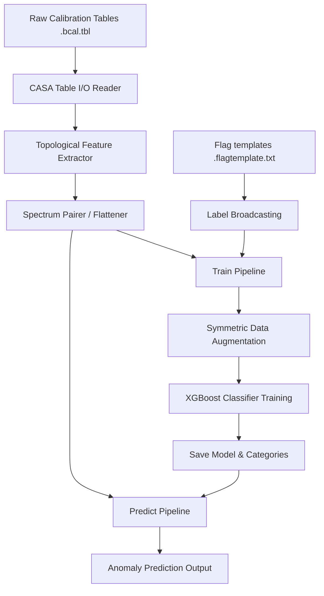

# Bandpass Amplitude Anomaly Classifier

A machine learning pipeline designed to classify amplitude anomalies in bandpass calibration spectra (e.g., from ALMA calibration tables) using XGBoost. The system processes raw calibration tables, extracts features (including scan statistics based scores and ALMA receiver bands), maps flag templates to train labels, and outputs predictions on unseen calibration tables.

---

## Table of Contents
1. [Project Structure](#project-structure)
2. [Core Architecture & Workflow](#core-architecture--workflow)
3. [Configuration (`config.toml`)](#configuration-configtoml)
4. [Feature Extraction Engine](#feature-extraction-engine)
5. [Getting Started & Usage](#getting-started--usage)
   - [Installation & Environment Setup](#installation--environment-setup)
   - [Environment Variables](#environment-variables)
   - [Training the Model](#training-the-model)
   - [Running Predictions](#running-predictions)

---

## Project Structure

```text
bandpass_classifier/
├── bandpass_classifier/            # Source package
│   ├── __init__.py                 # Package initializer
│   ├── train.py                    # Training pipeline entry point
│   ├── predict.py                  # Inference pipeline entry point
│   ├── io_utils.py                 # CASA table and flagtemplate parsing
│   ├── utils.py                    # Helper utilities (caching, encoding)
│   └── features/                   # Feature extraction sub-package
│       ├── __init__.py             # Auto-boots the registry
│       ├── extractor.py            # Topological feature extractor engine
│       ├── registry.py             # Feature module coordinator
│       ├── basic.py                # Base features (amplitude, NMAD)
│       └── scan_statistics/        # Advanced scan-based features
│           ├── features.py         # Registered scan stats features
│           └── scan_statistics.py  # Window searching and atmospheric line detection
├── inputs/                         # Data inputs directory (full_spectrum.gzip, tables)
├── models/                         # Model config and output artifacts
│   └── v1/
│       ├── config.toml             # Configuration file
│       ├── model.json              # Trained XGBoost model (generated after training)
│       └── column_categories.json  # Categorical feature mapping (generated after training)
├── environment.yml                 # Conda environment configuration
└── README.md                       # Documentation (this file)
```

---

## Core Architecture & Workflow


The pipeline consists of two main stages: **Training** and **Prediction**.



### 1. Data Loading (`io_utils.py` & `utils.py`)
- **CASA Tables**: Uses `casatools.table` to read calibration parameters (`CPARAM`), flags (`FLAG`), and spectral properties from `.bcal.tbl` structures.
- **Flag Templates**: Parses calibration flag files to determine ground truth reasons (e.g., `QA2:bandpass_amplitude_frequency`).
- **Label Broadcasting**: Uses `broadcast_na()` to map sparse flags to matching indexes across multi-index levels (Execution Block UID, Spectral Window, Antenna, Polarization).

### 2. Training (`train.py`)
- Loads and concatenates all matching bandpass tables.
- Aligns and maps flags to label each record as an anomaly (`True`/`False`).
- Splits training and testing partitions using an aggregated block structure (e.g., grouping by `eb_uid` to prevent leakage).
- Fits an XGBoost Classifier using `enable_categorical=True` and handles class imbalance using `scale_pos_weight`.
- Saves the trained model to JSON along with JSON-encoded category mappings.

### 3. Prediction (`predict.py`)
- Evaluates individual `.bcal.tbl` tables.
- Runs the topological feature extractor, performs categorization using saved mappings, and executes inference with the trained XGBoost model.

---

## Configuration (`config.toml`)

Configurations control data inputs, features, hyperparameters, and symmetry strategies. Key sections include:

- `[model]`: Paths to save or load the `model.json` and `column_categories.json` (supports relative paths resolved relative to the config file's parent directory).
- `[features]`: Declares shared features (e.g., `receiver_band`) and individual spectrum features (e.g., NMAD-based scores).
- `[training.data]`: File glob patterns for input tables/flag templates and the specific anomaly labels/reasons to target.
- `[training.hyperparameters]`: Parameters passed directly to the XGBoost backend.
- `[training.strategy]`: Implements dataset partitioning schemes and training-time data permutation (`symmetric = true` for order-invariant predictions).

---

## Feature Extraction Engine

Features are extracted dynamically using a custom topological dependency resolver:

1. **Topological Sorter (`features/extractor.py`)**: Resolves feature dependencies (e.g., `amp_norm_nmad_diff4` depends on `amp_nmad_diff4` and `amp_nmad`, which in turn depend on `amplitude`).
2. **Parallel execution**: Features are computed on chunked pandas DataFrames in parallel processes.
3. **Scan Statistics (`features/scan_statistics/`)**: Searches for sliding window discrepancies in amplitude across three modes (`fixed`, `masked`, `unmasked`). It integrates atmospheric transmission tables to account for natural absorption lines.
4. **Symmetric Pairing**: Spectrum features are paired side-by-side (suffixed `_0` and `_1`). Data augmentation is applied during training by swapping the order of the pairs.

---

## Getting Started & Usage

### Installation & Environment Setup

Create and activate the Conda environment using the provided `environment.yml` file:

```bash
# Create the environment
conda env create -f environment.yml

# Activate the environment
conda activate bandpass_classifier
```

### Environment Variables

The pipeline supports the following environment variables for caching and performance optimization:

| Variable | Default | Description |
| :--- | :--- | :--- |
| `BANDPASS_ENABLE_CACHE` | `0` (disabled) | Set to `1`, `true`, or `yes` to enable joblib disk caching for computationally intensive feature extractors (e.g. scan statistics). |
| `BANDPASS_CACHE_DIR` | `.cache` | Directory path where joblib cache artifacts will be stored when caching is enabled. |
| `BANDPASS_MAX_WORKERS` | `None` (auto/all cores) | Number of worker processes to use for parallel feature extraction in `process_map`. |
| `BANDPASS_DATA_DIR` | `None` (paths as configured) | Base directory path for training data patterns (supports absolute and relative paths). |

#### Examples

```bash
# Set a base directory for training data patterns
BANDPASS_DATA_DIR=/path/to/data python -m bandpass_classifier.train --config models/v1/config.toml

# Enable joblib disk caching with default location (.cache/)
BANDPASS_ENABLE_CACHE=1 python -m bandpass_classifier.train --config models/v1/config.toml

# Restrict parallel feature extraction to 4 worker processes
BANDPASS_MAX_WORKERS=4 python -m bandpass_classifier.train --config models/v1/config.toml

# Enable joblib disk caching with a custom directory path
BANDPASS_ENABLE_CACHE=1 BANDPASS_CACHE_DIR=/path/to/custom_cache python -m bandpass_classifier.predict \
    --config models/v1/config.toml \
    --bandpass_table path/to/your/table.solintinf.bcal.tbl
```

### Training the Model
To train the classifier using a specific configuration file:
```bash
python -m bandpass_classifier.train --config models/v1/config.toml
```
To overwrite existing model artifacts and intermediate outputs:
```bash
python -m bandpass_classifier.train --config models/v1/config.toml --overwrite
```
To run a fast test or train on a subset of the dataset:
```bash
python -m bandpass_classifier.train --config models/v1/config.toml --sample 1000
```

### Running Predictions
To detect anomalies in an unseen calibration table:
```bash
python -m bandpass_classifier.predict \
    --config models/v1/config.toml \
    --bandpass_table path/to/your/table.solintinf.bcal.tbl
```
